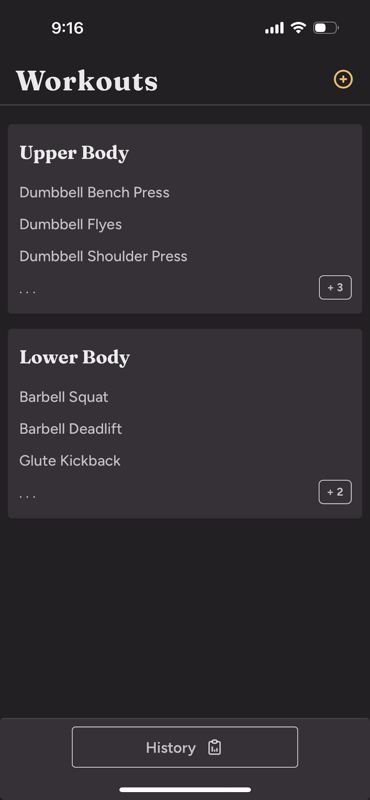
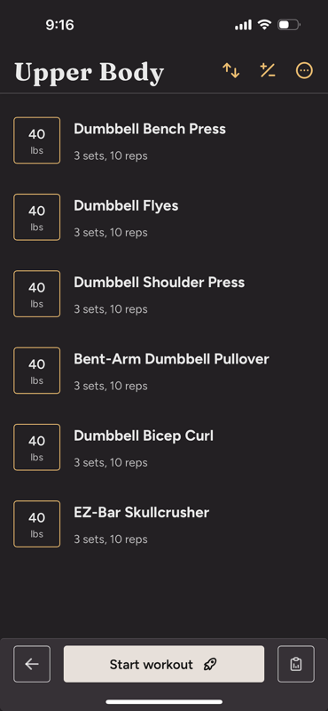
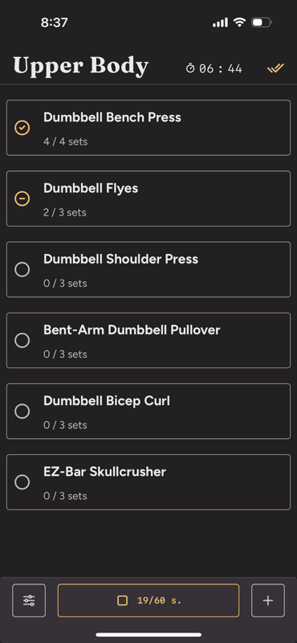
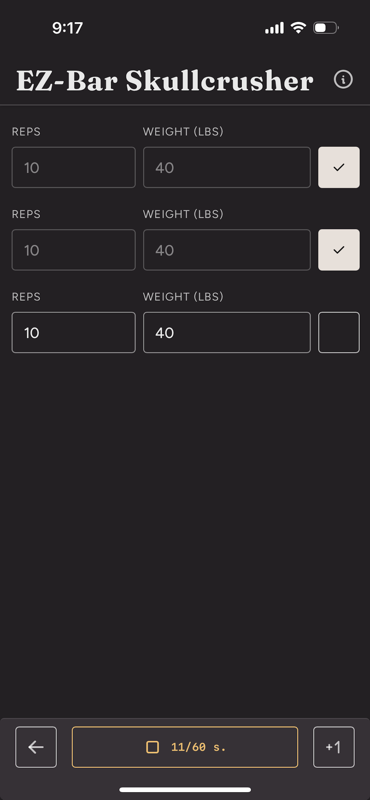
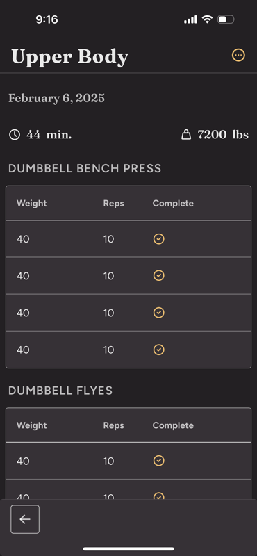

# Workouts by Early Bird

Cross-platform fitness tracking app built with Tauri, SvelteKit, and TypeScript.

## Features

- Create custom workouts with 15,000+ exercises
- Track sets, weights, and rest periods
- Offline-first with cloud sync
- Desktop and iOS support

## Screenshots

<div align="center">
  
  
  
  
  
</div>

## Development

```bash
pnpm dev              # Start development server
pnpm dev:ios          # iOS simulator
pnpm build            # Build for production
pnpm lint             # Code quality checks
```

## Tech Stack

- **Frontend**: SvelteKit + Svelte 5 + TypeScript
- **Backend**: Tauri (Rust)
- **Database**: Dexie + Dexie Cloud
- **Styling**: Tailwind CSS

## Known Issues

- **iOS 26 Liquid Glass Redesign**: Some pages have excessive scroll distance that may cause interactivity issues with elements in the lowest section of the screen. This affects user interaction with buttons and form controls near the bottom of certain views.
