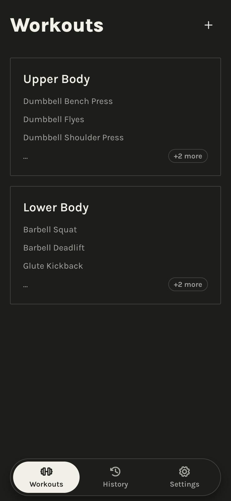
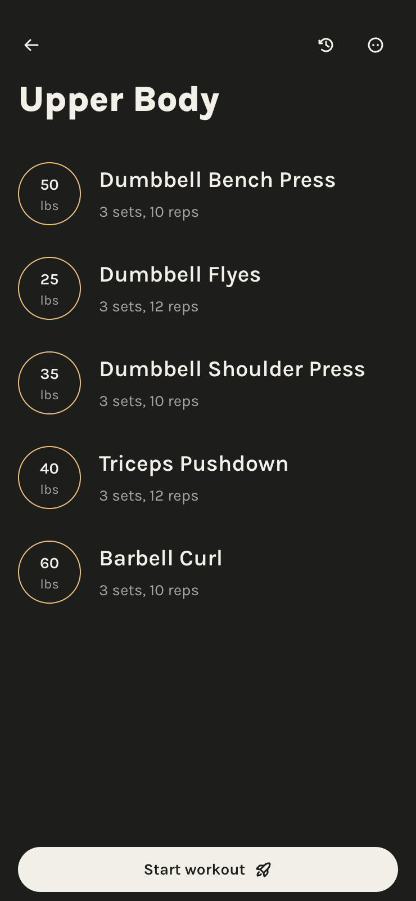
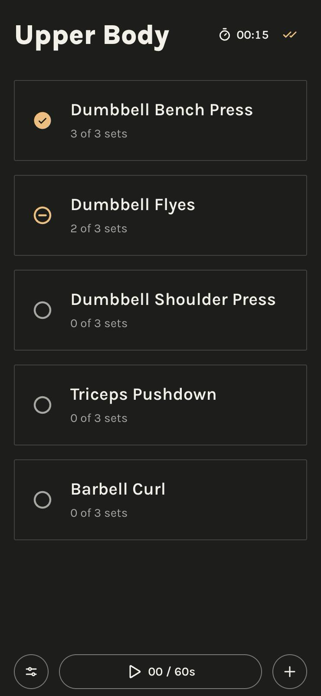
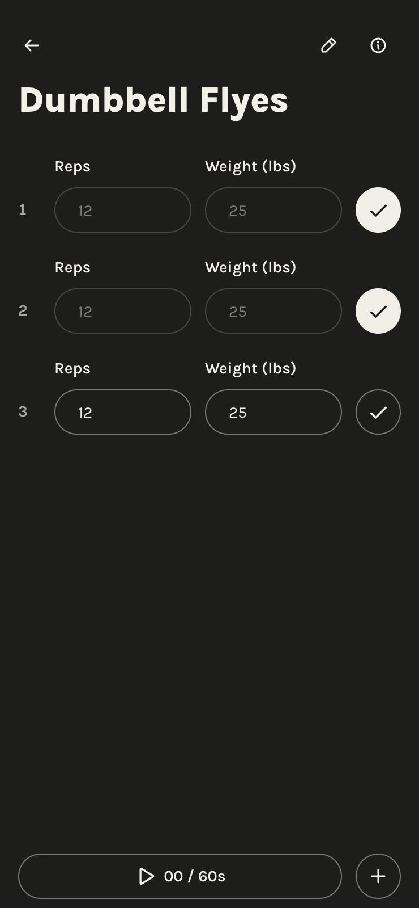
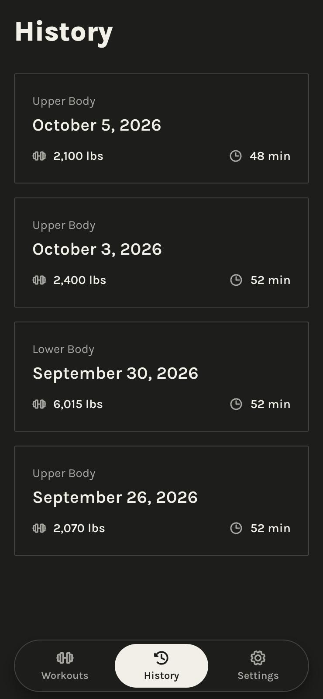

# Workouts by Early Bird

Installable, offline-first fitness tracking PWA built with React and TypeScript.

## Features

- **Custom Workouts**: Create personalized routines from 873 exercises
- **Comprehensive Tracking**: Log sets, weights, reps, and rest periods
- **Offline-First**: Full functionality without internet; your data stays on your device
- **Installable**: Add to your home screen on iOS, Android, or desktop for a full-screen app

## Try it Out

- **Web**: https://workouts.byearlybird.com

On iOS, open it in Safari and choose **Share → Add to Home Screen** to install it. _This app was developed for and tested primarily on iOS._

## Screenshots

<div align="center">
  
  
  
  
  
</div>

## Development

```bash
pnpm dev              # Start development server
pnpm build            # Build for production (includes the service worker)
pnpm preview          # Serve the production build to test offline/install
pnpm release          # Build and deploy to Cloudflare
pnpm lint             # Code quality checks
```

## Tech Stack

- **Frontend**: React 19 + TanStack Router + TypeScript
- **Design system**: EB (Base UI)
- **PWA**: vite-plugin-pwa (Workbox service worker, web app manifest)
- **Database**: Dexie (IndexedDB)
- **Styling**: EB + Tailwind CSS (layout)

## Known Issues

- **iOS 26 Liquid Glass Redesign**: Some pages have excessive scroll distance that may cause interactivity issues with elements in the lowest section of the screen. This affects user interaction with buttons and form controls near the bottom of certain views.
